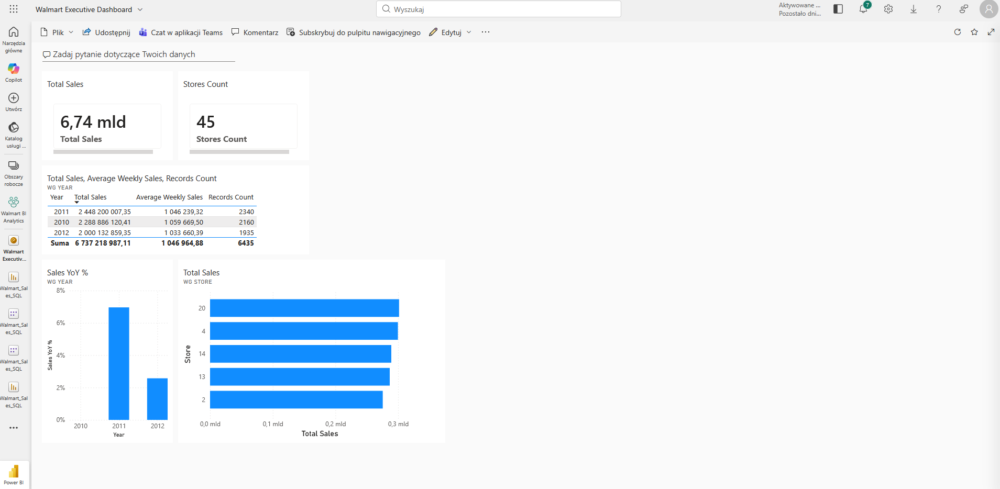
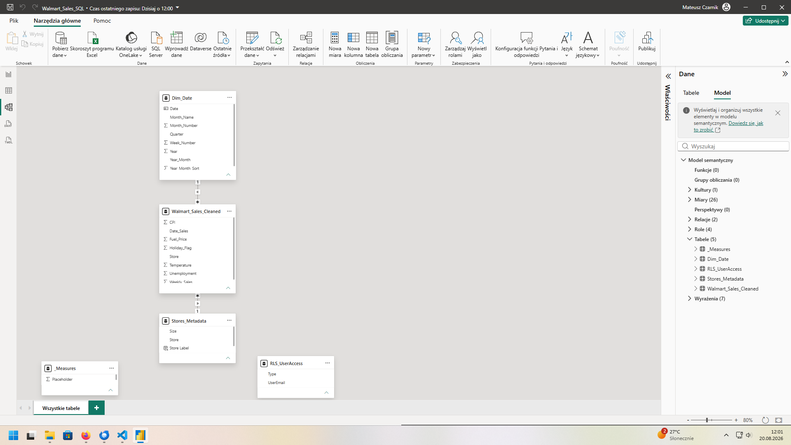
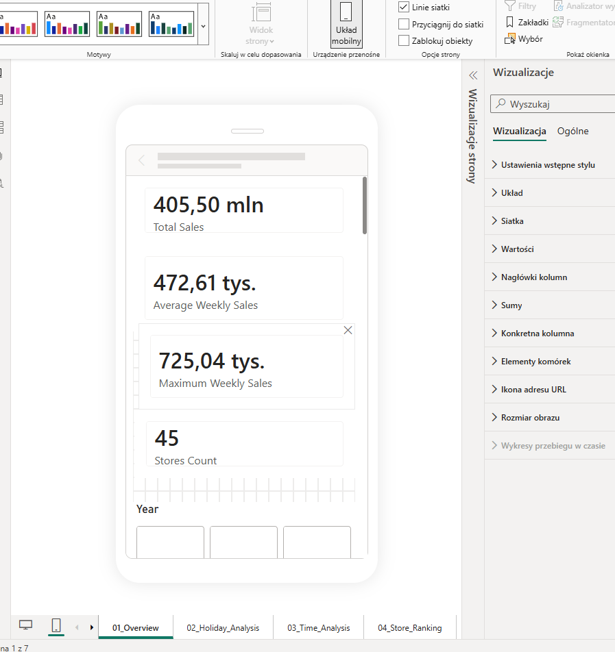
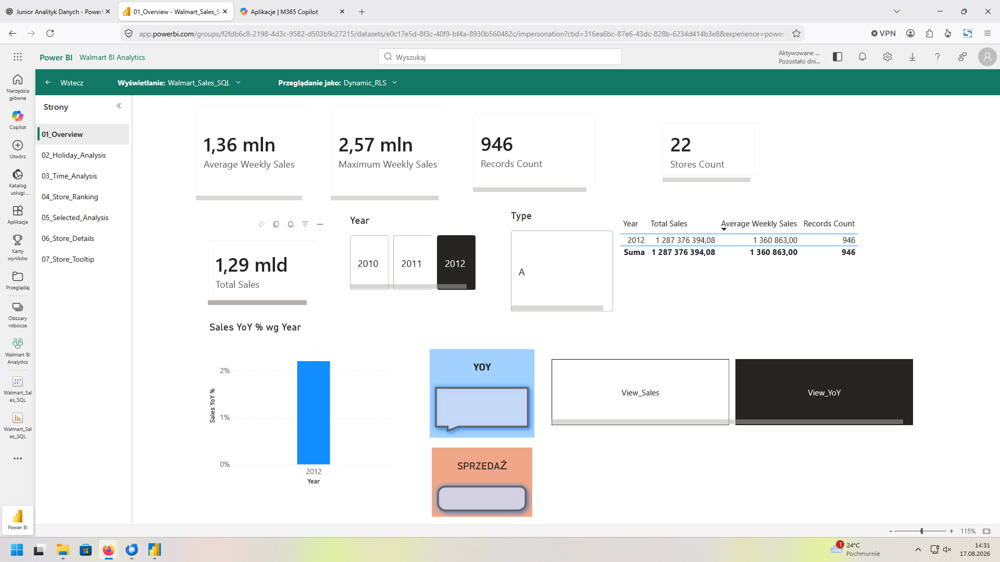
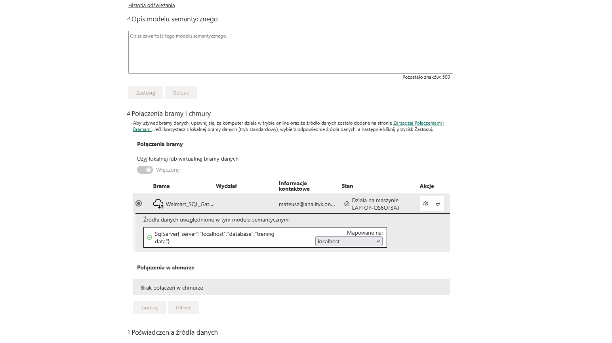
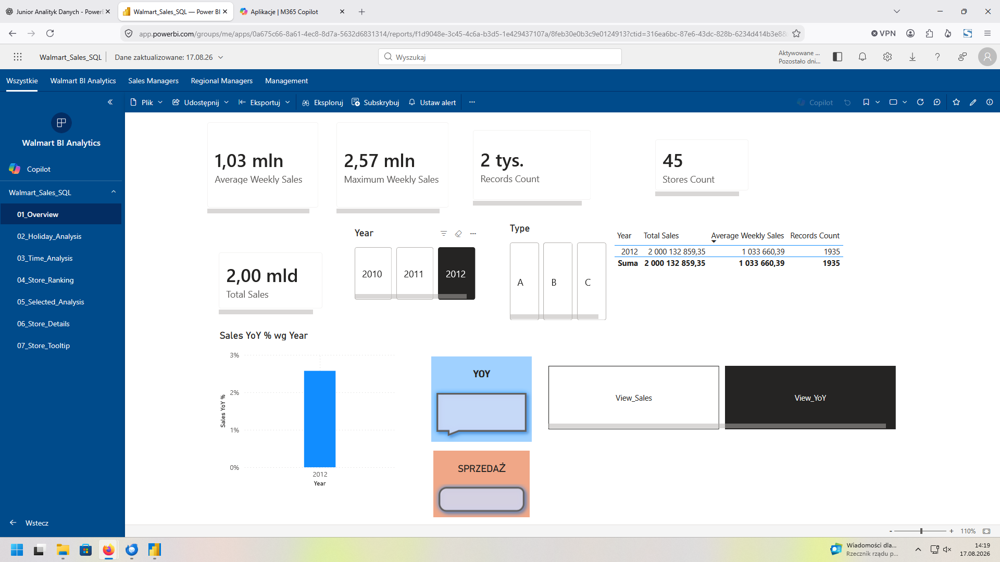
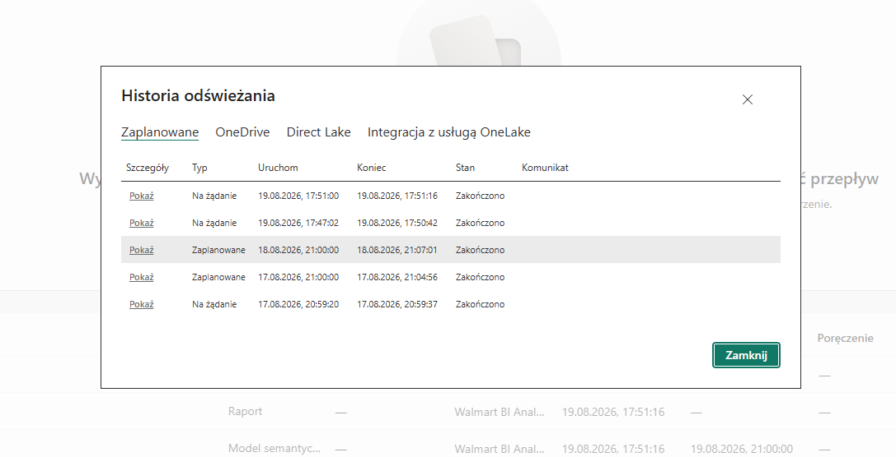

# Walmart Sales Performance Analysis

Kompleksowy projekt Business Intelligence zbudowany z wykorzystaniem **Microsoft SQL Server, T-SQL, Power Query, Power BI, DAX, Power BI Service, Git i GitHub**.

Projekt obejmuje pełny proces analityczny: audyt danych źródłowych, czyszczenie danych, modelowanie relacyjne, analizę SQL, przygotowanie warstwy raportowej, model semantyczny Power BI, miary DAX, interaktywny raport, Row-Level Security, publikację do Power BI Service, konfigurację Gateway, testy odświeżania, analizę wydajności oraz optymalizację raportu pod urządzenia mobilne.

---

## Opis projektu

Celem projektu jest analiza historycznych danych sprzedażowych Walmart oraz zbudowanie wielokrotnego użytku rozwiązania BI do monitorowania wyników sklepów.

Rozwiązanie umożliwia analizę:

- sprzedaży całkowitej i średniej,
- trendów sprzedaży w czasie,
- wyników rok do roku,
- sprzedaży w tygodniach świątecznych i nieświątecznych,
- rankingów sklepów,
- wyników według typu sklepu,
- analizy w kontekście zaznaczonej grupy sklepów,
- szczegółowych wyników pojedynczego sklepu,
- bezpiecznego dostępu do danych z wykorzystaniem Row-Level Security.

Projekt został przygotowany jako projekt portfolio na stanowiska **Junior Data Analyst, BI Analyst i SQL Analyst**.

---

## Cel biznesowy

Celem biznesowym jest dostarczenie osobom zarządzającym czytelnego obrazu wyników sprzedaży w podziale na sklepy i okresy czasu.

Raport odpowiada między innymi na następujące pytania:

1. Które sklepy generują najwyższą sprzedaż?
2. Jak sprzedaż zmienia się w czasie?
3. Jak bieżąca sprzedaż wypada w porównaniu z poprzednim rokiem?
4. Które typy sklepów generują najwyższą sprzedaż?
5. Czy tygodnie świąteczne różnią się od tygodni nieświątecznych?
6. Które sklepy zajmują najwyższe miejsca w rankingu w aktualnym kontekście?
7. Jaki udział w zaznaczonej sprzedaży ma każdy sklep?
8. Jak zmieniają się wyniki pojedynczego sklepu w czasie?
9. Które KPI powinny być monitorowane przez management?
10. Jak ograniczyć dostęp do danych dla różnych użytkowników?

---

## Źródła danych

Projekt wykorzystuje dwa pliki źródłowe CSV:

- `Walmart_Sales.csv` — tygodniowe dane sprzedażowe,
- `stores.csv` — metadane sklepów.

### Kolumny danych sprzedażowych Walmart

- `Store`
- `Date_Sales`
- `Weekly_Sales`
- `Holiday_Flag`
- `Temperature`
- `Fuel_Price`
- `CPI`
- `Unemployment`

### Kolumny metadanych sklepów

- `Store`
- `Type`
- `Size`

---

## Jakość danych i przygotowanie

Pierwotny import danych sprzedażowych zawierał zduplikowane rekordy.

| Metryka kontrolna | Wynik |
|---|---:|
| Liczba wierszy danych surowych | 12 870 |
| Liczba unikalnych wierszy po czyszczeniu | 6 435 |
| Usunięte duplikaty | 6 435 |
| Liczba sklepów | 45 |
| Zduplikowane sklepy w metadanych | 0 |

Proces przygotowania danych obejmował:

- kontrolę liczby rekordów,
- wykrywanie duplikatów,
- sprawdzanie brakujących wartości,
- konwersję typów danych,
- konwersję dat,
- utworzenie oczyszczonej tabeli faktów,
- walidację identyfikatorów sklepów,
- sprawdzanie unikalności,
- walidację relacji.

Główna oczyszczona tabela SQL:

```sql
dbo.Walmart_Sales_Cleaned
```

Ziarnistość tabeli:

> Jeden wiersz reprezentuje tygodniowy wynik sprzedaży jednego sklepu dla jednej daty sprzedaży.

Naturalny klucz złożony:

```sql
(Store, Date_Sales)
```

---

## Technologie

### Baza danych i SQL

- Microsoft SQL Server
- SQL Server Management Studio
- T-SQL

### Business Intelligence

- Power BI Desktop
- Power Query
- DAX
- Power BI Service
- On-premises Data Gateway

### Środowisko i kontrola wersji

- Visual Studio Code
- Git
- GitHub

### Zastosowane koncepcje

- walidacja jakości danych,
- modelowanie relacyjne,
- Star Schema,
- tabele faktów i wymiarów,
- Query Folding,
- Time Intelligence,
- Row-Level Security,
- Dynamic RLS,
- Incremental Refresh,
- analiza wydajności,
- projektowanie raportu mobilnego.

---

## Model danych SQL

Warstwa SQL zawiera dwie główne tabele biznesowe.

### Tabela faktów

```sql
dbo.Walmart_Sales_Cleaned
```

Główne kolumny:

- `Store`
- `Date_Sales`
- `Weekly_Sales`
- `Holiday_Flag`
- `Temperature`
- `Fuel_Price`
- `CPI`
- `Unemployment`

### Tabela wymiaru

```sql
dbo.Stores_Metadata
```

Główne kolumny:

- `Store`
- `Type`
- `Size`

### Relacja

```text
dbo.Stores_Metadata (1)
        |
        | Store
        |
        v
dbo.Walmart_Sales_Cleaned (*)
```

Jeden sklep w `dbo.Stores_Metadata` może mieć wiele tygodniowych rekordów sprzedaży w `dbo.Walmart_Sales_Cleaned`.

---

## Model semantyczny Power BI

Finalny model Power BI zawiera pięć tabel:

```text
Dim_Date
    1
    |
    *
Walmart_Sales_Cleaned
    *
    |
    1
Stores_Metadata


_Measures

RLS_UserAccess
```

### Role tabel w modelu

- `Walmart_Sales_Cleaned` — tabela faktów,
- `Stores_Metadata` — wymiar sklepu,
- `Dim_Date` — wymiar daty,
- `_Measures` — dedykowana tabela na miary DAX,
- `RLS_UserAccess` — tabela pomocnicza dla Dynamic Row-Level Security.

Finalny model portfolio celowo nie zawiera tymczasowej tabeli testowej używanej podczas ćwiczenia Incremental Refresh.

---

## Analiza SQL

Etap SQL obejmuje praktyczne wykorzystanie:

- `SELECT`
- `WHERE`
- `ORDER BY`
- `DISTINCT`
- `CASE`
- `GROUP BY`
- `HAVING`
- `INNER JOIN`
- `LEFT JOIN`
- `RIGHT JOIN`
- `FULL JOIN`
- `SELF JOIN`
- `UNION`
- `UNION ALL`
- Common Table Expressions
- funkcji okienkowych
- `ROW_NUMBER`
- `RANK`
- `DENSE_RANK`
- `LAG`
- `LEAD`
- widoków
- indeksów nonclustered
- procedur składowanych
- walidacji parametrów
- planów wykonania
- optymalizacji zapytań

---

## Warstwa raportowa SQL

Warstwa raportowa przygotowuje wielokrotnego użytku zestawy danych do raportowania biznesowego.

Obejmuje:

- wzbogacone dane sprzedażowe,
- podsumowania sprzedaży według sklepu,
- ranking według sprzedaży całkowitej,
- najlepsze tygodnie sprzedażowe,
- zmiany sprzedaży tydzień do tygodnia,
- porównanie tygodni świątecznych i nieświątecznych,
- raporty parametryzowane,
- indeksy wspierające najczęstsze filtry,
- zoptymalizowane filtrowanie po zakresach dat.

Przykład filtra daty typu SARGable:

```sql
WHERE Date_Sales >= '20110101'
  AND Date_Sales <  '20120101';
```

Taki zapis jest preferowany w stosunku do:

```sql
WHERE YEAR(Date_Sales) = 2011;
```

ponieważ filtr zakresowy może efektywniej wykorzystać indeks na kolumnie `Date_Sales`.

---

## Procedury składowane

Procedury składowane są wykorzystywane do tworzenia wielokrotnego użytku raportów z parametrami takimi jak:

- numer sklepu,
- data początkowa,
- data końcowa,
- flaga świąteczna.

Projekt dokumentuje również automatyzację procedur z wykorzystaniem:

- SQL Server Agent,
- SQL Server Agent Jobs,
- harmonogramów cyklicznych.

---

## Optymalizacja zapytań

Etap optymalizacji SQL obejmuje:

- Estimated Execution Plan,
- Actual Execution Plan,
- `SET STATISTICS IO ON`,
- `SET STATISTICS TIME ON`,
- `Index Seek`,
- `Index Scan`,
- `Key Lookup`,
- filtry SARGable,
- unikanie niepotrzebnego `SELECT *`,
- unikanie funkcji na filtrowanych kolumnach,
- porównanie wydajności przed i po zmianie.

Schemat optymalizacji:

```text
Poprawny wynik
    ↓
Pomiar wydajności
    ↓
Jedna zmiana
    ↓
Ponowny pomiar
    ↓
Porównanie wyniku
```

---

## Power Query

Power Query jest wykorzystywany do:

- połączenia Power BI z SQL Server,
- walidacji jakości danych,
- profilowania kolumn,
- filtrowania danych,
- tworzenia zapytań pomocniczych,
- budowy tabeli dat,
- zachowania Query Folding tam, gdzie to możliwe,
- przygotowania danych do modelu semantycznego.

Projekt zawiera również praktyczne ćwiczenie Incremental Refresh wykorzystujące:

```text
RangeStart
RangeEnd
```

oraz filtr:

```text
Date >= RangeStart
Date <  RangeEnd
```

---

## Miary DAX

Raport zawiera miary dotyczące sprzedaży, Time Intelligence, rankingów i analizy kontekstu.

### Total Sales

```DAX
Total Sales =
SUM(Walmart_Sales_Cleaned[Weekly_Sales])
```

### Stores Count

```DAX
Stores Count =
DISTINCTCOUNT(Walmart_Sales_Cleaned[Store])
```

### Sales Previous Year

```DAX
Sales Previous Year =
CALCULATE(
    [Total Sales],
    SAMEPERIODLASTYEAR(Dim_Date[Date])
)
```

### Sales YoY %

```DAX
Sales YoY % =
DIVIDE(
    [Total Sales] - [Sales Previous Year],
    [Sales Previous Year]
)
```

Pozostałe obszary DAX obejmują:

- kalkulacje YTD,
- sprzedaż w tygodniach świątecznych,
- sprzedaż w tygodniach nieświątecznych,
- rankingi sklepów,
- rankingi w kontekście zaznaczenia,
- udział sklepu w sprzedaży,
- udział sklepu w sprzedaży zaznaczonej,
- porównania do poprzedniego roku.

---

## Strony raportu

### 01 — Overview

Strona podsumowująca najważniejsze KPI i filtry.

Zawiera:

- Total Sales,
- Average Weekly Sales,
- Maximum Weekly Sales,
- Records Count,
- Stores Count,
- filtr Year,
- filtr Store Type,
- wizualizację Sales YoY,
- tabelę podsumowującą,
- przełączanie widoków oparte na bookmarkach.

### 02 — Holiday Analysis

Porównuje sprzedaż w tygodniach świątecznych i nieświątecznych.

Zawiera:

- Holiday Sales,
- Holiday Sales Share %,
- Average Holiday Weekly Sales,
- Holiday Average Uplift %,
- porównanie holiday vs non-holiday.

### 03 — Time Analysis

Skupia się na analizie czasu.

Zawiera:

- Total Sales,
- Sales Previous Year,
- Sales YoY Change,
- Sales YoY %,
- Sales YTD,
- miesięczny trend sprzedaży.

### 04 — Store Ranking

Tworzy ranking sklepów według wyników sprzedażowych.

Zawiera:

- tabelę rankingu sklepów,
- wizualizację Top Stores,
- KPI Top Store Sales,
- filtry Year i Type.

### 05 — Selected Analysis

Pokazuje obliczenia zależne od aktualnie zaznaczonego kontekstu.

Zawiera:

- Selected Stores Sales,
- Store Sales Share %,
- Store Sales Share Selected %,
- Store Rank,
- Store Rank Selected.

Strona pokazuje praktyczną różnicę pomiędzy `ALL` i `ALLSELECTED`.

### 06 — Store Details

Strona Drill-through do szczegółowej analizy pojedynczego sklepu.

Zawiera:

- Total Sales,
- Average Weekly Sales,
- Sales Previous Year,
- Sales YoY %,
- Holiday Sales,
- Non-Holiday Records Count,
- metadane sklepu,
- trend sprzedaży po dacie.

### 07 — Store Tooltip

Strona typu report-page tooltip prezentująca kompaktowe informacje kontekstowe dla wybranego sklepu.

---

## Zaimplementowane funkcje Power BI

- transformacje Power Query,
- Star Schema,
- dedykowana tabela dat,
- miary DAX,
- karty KPI,
- Time Intelligence,
- `ALL` i `ALLSELECTED`,
- rankingi,
- Drill-through,
- report-page tooltip,
- bookmarks,
- synchronizacja slicerów,
- interakcje wizualizacji,
- Static Row-Level Security,
- Dynamic Row-Level Security,
- `USERPRINCIPALNAME()`,
- publikacja do Power BI Service,
- Workspace,
- Power BI App,
- App Audiences,
- dashboard tiles,
- data alerts,
- subscriptions,
- On-premises Data Gateway,
- scheduled refresh,
- demonstracja Incremental Refresh,
- Performance Analyzer,
- DAX Query View,
- audyt kardynalności,
- Mobile Layout,
- Alt Text,
- Tab Order.

---

## Row-Level Security

### Static RLS

Static RLS został przetestowany z wykorzystaniem ograniczenia po typie sklepu.

Przykład:

```DAX
[Type] = "A"
```

### Dynamic RLS

Dynamiczne zabezpieczenia wykorzystują:

```DAX
USERPRINCIPALNAME()
```

wraz z tabelą pomocniczą `RLS_UserAccess`.

Pozwala to sterować dostępem do danych na podstawie aktualnie zalogowanego użytkownika Power BI.

---

## Power BI Service

Raport został opublikowany do Power BI Service i skonfigurowany w dedykowanym Workspace.

Etap Power BI Service obejmuje:

- publikację raportu,
- model semantyczny,
- dostęp do Workspace,
- Power BI App,
- App Audiences,
- przypisywanie użytkowników do ról RLS,
- mapowanie Gateway,
- ręczne odświeżanie,
- scheduled refresh,
- historię odświeżeń,
- dashboard,
- alerty,
- subskrypcje.

---

## Gateway i odświeżanie

Projekt wykorzystuje **On-premises Data Gateway** do połączenia Power BI Service z lokalną instancją Microsoft SQL Server.

Przepływ odświeżania:

```text
SQL Server
    ↓
On-premises Data Gateway
    ↓
Power BI Service
    ↓
Semantic Model
    ↓
Report / Dashboard
```

---

## Demonstracja Incremental Refresh

Incremental Refresh został zaimplementowany jako demonstracja techniczna.

Treningowy zbiór zawiera tylko 6 435 oczyszczonych rekordów tabeli faktów, dlatego Incremental Refresh nie jest wymagany wydajnościowo w finalnym modelu portfolio.

W ramach ćwiczenia:

- utworzono `RangeStart` i `RangeEnd`,
- zastosowano filtr Date/Time,
- skonfigurowano politykę Incremental Refresh,
- opublikowano model do Power BI Service,
- zweryfikowano historię odświeżania.

Zaobserwowane czasy odświeżania:

- pierwsze ręczne odświeżenie: około **3 min 40 s**,
- kolejne ręczne odświeżenie: około **16 s**.

Tymczasowa tabela testowa Incremental Refresh została usunięta z finalnego modelu portfolio, aby zachować jego przejrzystość.

---

## Analiza wydajności

Do oceny wydajności raportu wykorzystano Power BI Performance Analyzer.

Analiza wykazała:

- główne zapytania DAX wykonywały się w czasie kilku milisekund,
- nie wykryto istotnego bottlenecku DAX,
- dla części wizualizacji renderowanie zajmowało większą część czasu niż samo obliczenie DAX,
- model nie wymagał istotnej przebudowy DAX.

DAX Query View został wykorzystany do analizy i wykonywania zapytań zawierających:

- `EVALUATE`,
- `SUMMARIZECOLUMNS`,
- `TREATAS`,
- `ORDER BY`.

Wykonano również audyt kardynalności tabeli faktów.

| Kolumna | Kardynalność |
|---|---:|
| Store | 45 |
| Date_Sales | 143 |
| Weekly_Sales | 6 435 |
| Holiday_Flag | 2 |
| Temperature | 3 528 |
| Fuel_Price | 892 |
| CPI | 2 145 |
| Unemployment | 349 |

---

## Mobile Layout i dostępność

Raport zawiera dedykowany Mobile Layout.

Wprowadzone elementy dostępności obejmują:

- Mobile Layout,
- czytelne rozmiary KPI,
- Alt Text,
- logiczny Tab Order,
- czytelne tytuły wizualizacji,
- unikanie polegania wyłącznie na kolorze tam, gdzie to możliwe.

---

## Najważniejsze wnioski

Analiza pozwoliła sformułować kilka obserwacji biznesowych:

- Store 20 wygenerował najwyższą całkowitą sprzedaż w pełnym zbiorze danych.
- Wielkość sklepu wykazała najsilniejszą dodatnią zależność z tygodniową sprzedażą w analizie eksploracyjnej — korelacja wyniosła około `0.81`.
- Tygodnie świąteczne miały wyższą średnią tygodniową sprzedaż niż tygodnie nieświąteczne.
- Całkowita sprzedaż w tygodniach nieświątecznych była wyższa, ponieważ zbiór zawiera znacznie więcej obserwacji nieświątecznych.
- Typ sklepu i jego wielkość powinny być analizowane łącznie przy interpretacji wyników.
- Korelacja między wielkością sklepu a sprzedażą nie dowodzi, że zwiększenie powierzchni sklepu bezpośrednio powoduje wzrost sprzedaży.

Raport Power BI umożliwia dodatkowo interaktywną analizę według roku, typu sklepu i aktualnego wyboru użytkownika.

---

## Screenshoty

### Executive Dashboard



### Model danych

Dodaj finalny screenshot modelu jako:

```text
docs/screenshots/data-model.png
```

Następnie włącz:

```markdown

```

### Mobile Layout



### Dynamic RLS



### Gateway



### Power BI App



### Incremental Refresh



Dodatkowe techniczne screenshoty znajdują się w:

```text
docs/screenshots/
```

---

## Struktura repozytorium

Repozytorium jest podzielone na osobne katalogi dla danych źródłowych, skryptów SQL, pliku Power BI, dokumentacji i screenshotów.

```text
walmart-sales-performance-analysis/
├── data/
├── docs/
├── notes/
├── powerbi/
├── sql/
├── README.md
└── struktura.txt
```

Pełne drzewo repozytorium znajduje się w pliku:

[`struktura.txt`](struktura.txt)

---

## Jak uruchomić projekt

### 1. Przygotuj SQL Server

Utwórz lub wybierz bazę projektu w SQL Server Management Studio.

### 2. Zaimportuj dane źródłowe

Zaimportuj:

```text
Walmart_Sales.csv
stores.csv
```

### 3. Uruchom skrypty SQL

Wykonuj skrypty z katalogu `sql/` w kolejności numerycznej.

### 4. Zweryfikuj oczyszczone tabele

Oczekiwane główne wyniki:

```text
dbo.Walmart_Sales_Cleaned → 6 435 wierszy
dbo.Stores_Metadata        → 45 wierszy
```

### 5. Otwórz Power BI

Otwórz plik `.pbix` znajdujący się w:

```text
powerbi/
```

### 6. Skonfiguruj połączenie z SQL Server

W razie potrzeby zaktualizuj lokalne połączenie z SQL Server.

### 7. Odśwież model semantyczny

Uruchom odświeżanie Power Query i zweryfikuj relacje oraz miary.

> Odświeżanie w Power BI Service wymaga poprawnie skonfigurowanego Gateway i poświadczeń dla docelowego środowiska.

---

## Przepływ projektu

```text
Pliki CSV
      ↓
Import do SQL Server
      ↓
Audyt i czyszczenie danych
      ↓
Analiza SQL
      ↓
Widoki / procedury / indeksy
      ↓
Power Query
      ↓
Star Schema
      ↓
Miary DAX
      ↓
Raport Power BI
      ↓
RLS
      ↓
Power BI Service
      ↓
Gateway / Refresh
      ↓
Dashboard / App
      ↓
Audyt wydajności i UX
```

---

## Status projektu

### Zakończone

- audyt danych źródłowych,
- wykrywanie duplikatów,
- oczyszczona tabela faktów SQL,
- konwersja typów danych,
- model relacyjny,
- JOIN-y i agregacje SQL,
- CTE,
- funkcje okienkowe,
- rankingi,
- `LAG` / `LEAD`,
- widoki raportowe,
- indeksy,
- procedury składowane,
- optymalizacja zapytań,
- Power Query,
- Star Schema,
- tabela dat,
- miary DAX,
- Time Intelligence,
- rankingi i analiza kontekstu,
- Drill-through,
- strona Tooltip,
- Bookmarks,
- synchronizacja slicerów,
- RLS i Dynamic RLS,
- publikacja do Power BI Service,
- Workspace i App,
- konfiguracja Gateway,
- testy odświeżania,
- dashboard,
- alerty i subskrypcje,
- demonstracja Incremental Refresh,
- Performance Analyzer,
- DAX Query View,
- audyt kardynalności,
- Mobile Layout,
- poprawki dostępności,
- dokumentacja portfolio.

**Status projektu: zakończony.**

---

## Umiejętności pokazane w projekcie

Projekt pokazuje praktyczną znajomość:

- analizy danych w SQL,
- walidacji jakości danych,
- modelowania relacyjnego,
- optymalizacji zapytań SQL,
- raportowania biznesowego,
- Power Query,
- modelowania semantycznego Power BI,
- Star Schema,
- DAX,
- Time Intelligence,
- filter context,
- rankingów,
- `ALL` / `ALLSELECTED`,
- RLS,
- Power BI Service,
- Gateway,
- zarządzania odświeżaniem,
- analizy wydajności raportu,
- UX i dostępności raportu,
- Git i GitHub.

---

## Możliwe dalsze rozwinięcia

Projekt można w przyszłości rozbudować o:

- większy, bardziej produkcyjny zbiór danych,
- produkcyjny Incremental Refresh dla dużej tabeli faktów,
- automatyzację wdrożeń pomiędzy środowiskami development i production,
- dodatkowe wymiary biznesowe, np. produkt, region lub klient,
- KPI z targetami i analizą odchyleń,
- osobną warstwę prezentacyjną dla managementu,
- automatyczne testy jakości danych.

---

## Podsumowanie na rozmowę rekrutacyjną

> Zbudowałem kompleksowe rozwiązanie BI do analizy sprzedaży Walmart z wykorzystaniem Microsoft SQL Server i Power BI. W SQL Server przeprowadziłem audyt i czyszczenie danych, przygotowałem model faktów i wymiarów oraz wielokrotnego użytku obiekty raportowe. Power BI został połączony z przygotowanymi danymi, a model zbudowałem w podejściu Star Schema z dedykowaną tabelą dat i miarami DAX dla sprzedaży, YoY, YTD, rankingów oraz analizy zaznaczonego kontekstu. Raport zawiera Drill-through, Tooltips, Bookmarks i Row-Level Security. Rozwiązanie opublikowałem do Power BI Service, skonfigurowałem On-premises Data Gateway i odświeżanie, przetestowałem Incremental Refresh, przeanalizowałem wydajność za pomocą Performance Analyzer oraz przygotowałem Mobile Layout.

---

## Autor

**Mateusz Czarnik**

Projekt portfolio przygotowany w ramach nauki i przygotowania do pracy na stanowiskach **Junior Data Analyst, BI Analyst i SQL Analyst**.
